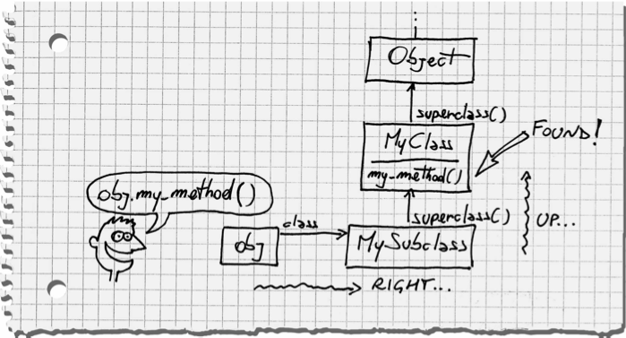

# Meta Programming

It can be fun at first, but like running with scissors someone may get hurt


# Method Lookup
An instance object doesnt contain the definition of its class methods. Class method of an instance are stored on the class or module. When a call a method on a instance object Ruby up a heirarchy of classes and methods until it finds the method being called.

## Go One Step Right then Up
This is the way most people describe Ruby's method lookup due to the way people usually draw the diagram to illustrate the behavior.



# Ancestors Chain
When a class inherits from another class or a module is included in a class those methods that are defined in those classes and modules are placed into an ancestor chain. This ancestor chain is what is used to determine what methods or classes to look at when doing the method lookup on an instance object.

# Class Eval
Class eval opens the class and adds the method to the class itself. While this takes longer to define a method it puts the new method in the ancestor chain where it can be accessed quicker than if you used define_method.

```RUBY
module Square
  class_eval <<-RUBY
    def eval_square(x)
    x + x
    end
  RUBY
end
```

```RUBY
class TestMath
  include Square
end
```


```RUBY
test = TestMath.new
test.class.ancestors
=> [TestMath, Square, Object, Kernel, BasicObject]
```

# Define Method


Define method, while faster to create the method definition it has a little overhead that will slow the methods execution down. While this performance hit is relatively small it has an accumulative effect that can slow down code if the method is called multiple times in a row.

The `class_eval` instantiates a new parser and compiles the source. Each method definition in the `class_eval` version does not share instruction sequences, where the `define_method` version does.


# Instruction Sequence

When Ruby compiles the code it will create instructions that `YARV` or whatever Ruby VM you are using. These instructions will differ between different that different ways you can define a method even if the code in that method are basicly the same.

```RUBY
# Defines the methods normally
module Foo
  def my_method
    'module method'
  end
end

# Defines the method using class eval
module ClassFoo
  class_eval <<-RUBY
    def my_method
      'Class evaluated method'
    end
  RUBY
end

# Defines the methods using define_method
module DefineFoo
  define_method 'my_method' do
    'Define method method'
  end
end


# Base Class
class MyClass
  def my_method
    'class method'
  end
end

# Subclass normal methods
class MySubclass < MyClass
  include Foo
end

# class using class eval methods
class CEClass < MyClass
  include ClassFoo
end

# Class using define method methods
class DMClass < MyClass
  include DefineFoo
end

class_evaluated = CEClass.new
dynamiclly_defined = DMClass.new
normally_defined = MySubclass.new
```
Above we have three modules that each implement the same method in different ways; `def`, `class_eval`, and `define_method`. Each module has been included in its own class.

With the help of RubyVM's `RubyVM::InstructionSequence` we can get a human readable string of instruction sequences for a specific method. Using the `disassemble` method we will see each instruction.

## Using `def`
```
irb(main):023:0> puts RubyVM::InstructionSequence.disasm(normally_defined.method(:my_method))
== disasm: <RubyVM::InstructionSequence:my_method@/Users/brian.mehrman/ruby_projects/lightning_talks/class_eval-vs-define_method/dynamic_methods.rb>
0000 trace            8                                               (  20)
0002 trace            1                                               (  21)
0004 putstring        "module method"
0006 trace            16                                              (  22)
0008 leave                                                            (  21)
```

## Using `class_eval`
```
irb(main):019:0> puts RubyVM::InstructionSequence.disasm(class_evaluated.method(:my_method))
== disasm: <RubyVM::InstructionSequence:my_method@(class_evaluated)>===============
0000 trace            8                                               (   1)
0002 trace            1                                               (   2)
0004 putstring        "Class evaluated method"
0006 trace            16                                              (   3)
0008 leave                                                            (   2)
```

## Using `define_method`
```
irb(main):020:0> puts RubyVM::InstructionSequence.disasm(dynamiclly_evaluated.method(:my_method))
== disasm: <RubyVM::InstructionSequence:block in <module:DefineFoo>@/Users/brian.mehrman/ruby_projects/lightning_talks/class_eval-vs-define_method/dynamic_methods.rb>
== catch table
| catch type: redo   st: 0002 ed: 0006 sp: 0000 cont: 0002
| catch type: next   st: 0002 ed: 0006 sp: 0000 cont: 0006
|------------------------------------------------------------------------
0000 trace            256                                             (  13)
0002 trace            1                                               (  14)
0004 putstring        "Define method method"
0006 trace            512                                             (  15)
0008 leave                                                            (  14)
```
At a quick glance we can see a major difference between the instructions for the method created using `define_method`. This extra step helps to slow down the methods execution.

# Conclusion

While `define_method` is quick to create your method it is slower to execute. It also is placed higher up the ancestor chain, slowing the method lookup as well. Define method is great when you need to create a method that will be used in low volume. Using `class_eval` is slower to define the method, yet it provides the benefit of executing faster than if it were defined using `define_method`. The methods defined using `class_eval` also are placed lower in the ancestor chain.

Meta-programming is a great way to dry up your code and create code that can essentially write itself. This benefit comes at a cost, knowing what that cost is can help in deciding what approach you show take.
